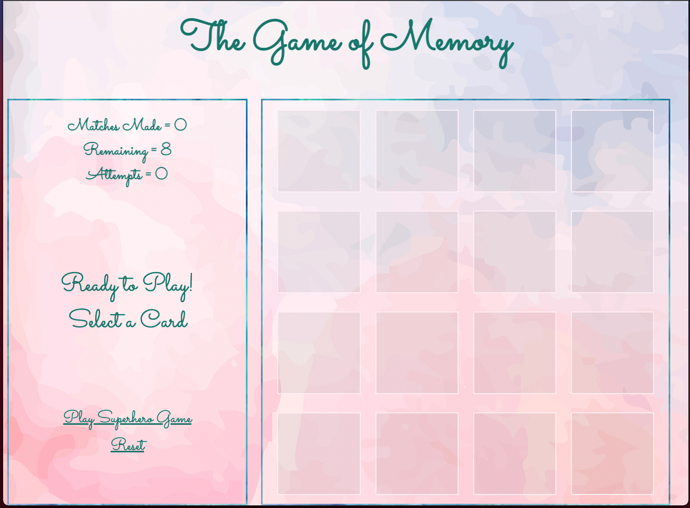
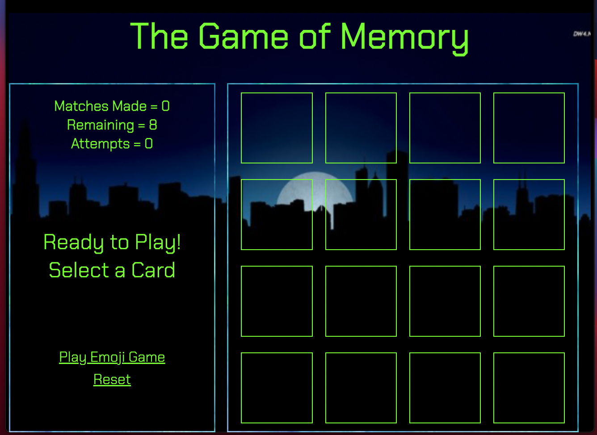

## Project Choice: The Game of Memory

## Project Description 
A browser-based Memory game coded in JavaScript, HTML and CSS.

Link to the [game](https://ramag1.github.io/emoji-memory/).

## Installation Instructions
Fork the repo and clone it down to your machine, then host on a live server!

## Wireframe

## User Stories

### MVP Goals
As a user, I want a browser-based interface so that I can play the game.
As a user, I want to select the game cards and see them turn over so that I can interact with the game.
As a user, I want matching cards to stay flipped over so I know I found a matching pair.
As a user, I want 1 win condition where all cards are matched and turned over, So I know that I have won.
As a user, I want the game to reach a win state so that I know I won and can play again.
As a user, I want to see a WINNER screen pop up when I have won to celebrate.

### Stretch Goals
As a user, I want to see a timer on the consle to add difficulty to the game.
As a user, I want to see two modes of the game.
As a user, I want to see the matched pairs disappear.
As a user, I want to see an animation when the cards flip over.
As a user, I want to see a randomized order of cards for each new round.
As a user, I want to be able to play this game on a mobile device.
As a user, I want to log my best number of attempts in the game.

## Open Issues & Challenges

No functional open issues at this point.
I have not figured out how to switch script files to add a second level yet, will continue to investigate.
Biggest challenge here was drying up code and looking for most streamlined way to evaluate.
