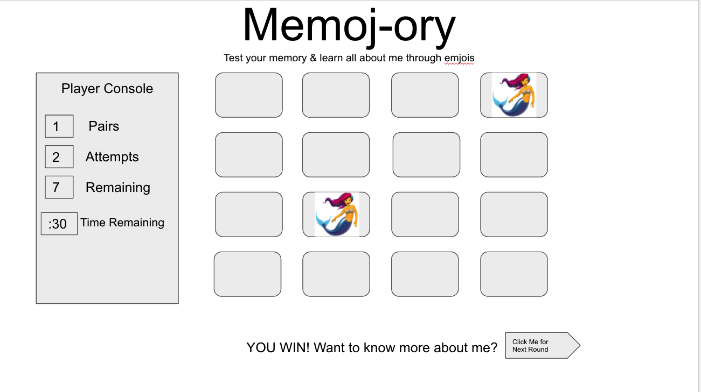

## Project Choice: Flashcards/Memory

## Project Description 
A browser-based Memory game coded in JavaScript, HTML and CSS.

## Wireframe

## User Stories

### MVP Goals
As a user, I want a browser-based interface so that I can play the game.
As a user, I want to select the game cards and see them turn over so that I can interact with the game.
As a user, I want matching cards to stay flipped over so I know I found a matching pair.
As a user, I want 1 win condition where all cards are matched and turned over, So I know that I have won.
As a user, I want the game to reach a win state so that I know I won and can play again.
As a user, I want to see a WINNER screen pop up when I have won to celebrate.

### Stretch Goals
As a user, I want to see a timer on the consle to add difficulty to the game.
As a user, I want to see the matched pairs disappear.
As a user, I want to see an animation when the cards flip over.
As a user, I want to see a randomized order of cards for each new round.
As a user, I want the ability to play a more challenging level after I win, featuring more cards.
As a user, I want a pop up modal with instructions on how to play the game.
As a user, I want to log my best time result in the game.
As a user, I want to play and track a multitude of rounds on a scoreboard.
